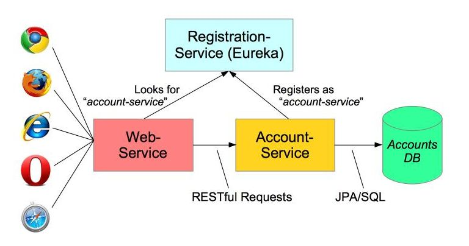

# Middleware Engineering "Microservices"

## Aufgabenstellung
Die detaillierte [Aufgabenstellung](TASK.md) beschreibt die notwendigen Schritte zur Realisierung.

# Microservices-demo

Demo application to go with my [Microservices Blog](https://spring.io/blog/2015/07/14/microservices-with-spring) on the spring.io website.  **WARNING:** Only maven build has been updated.  Gradle build still to be done.



Clone it and either load into your favorite IDE or use maven/gradle directly.

_Note for gradle users:_ to make the intructions below build-tool independent, the gradle build copies its artifacts from `build/libs` to `target`.

## Versions

Current version (June 2018) v2.0.0 corresponds to Spring Boot 2 and Finchly release train.

**WARNING:** Only maven build has been updated.  Gradle build still to be done.

Previous versions have been tagged and can be accessed using the `Branch` button above or using `git checkout <version>` - for example `git checkout v1.2.0`.

Tagged versions are:

* v2.0.0 - Spring Boot 2.0 and Spring Cloud release-train Finchley
* v1.2.0 corresponds to Spring Boot 1.5 and Spring Cloud release-train Edgeware
* v1.1.0 corresponds to Spring Cloud release-train Brixton
* v1.0.0 corresponds to Spring Cloud release-train Angel.SR6

## Using an IDE

You can run the system in your IDE by running the three server classes in order: _RegistrationService_, _AccountsService_ and _WebService_.  Each is a Spring Boot application using embedded Tomcat.  In Spring Tool Suite use `Run As ... Spring Boot App` otherwise just run each as a Java application - each has a static `main()` entry point.

As discussed in the Blog, open the Eureka dashboard [http://localhost:1111](http://localhost:1111) in your browser to see that the `ACCOUNTS-SERVICE` and `WEB-SERVICE` applications have registered.  Next open the Demo Home Page [http://localhost:3333](http://localhost:3333) in and click one of the demo links.

The `localhost:3333` web-site is being handled by a Spring MVC Controller in the _WebService_ application, but you should also see logging output from _AccountsService_ showing requests for Account data.

## Command Line

You may find it easier to view the different applications by running them from a command line since you can place the three windows side-by-side and watch their log output

For convenience we are building a 'fat' executble jar whose start-class (main method entry-point) is defined to be in the class `io.pivotal.microservices.services.Main`.  This application expects a single command-line argument that tells it to run as any of our three servers.

```
java -jar target/microservices-demo-2.0.0.RELEASE.jar registration|accounts|web
```

### Priocedure

To run the microservices system from the command-line, open three CMD windows (Windows) or three Terminal windows (MacOS, Linux) and arrange so you can view them conveniently.

 1. In each window, change to the directory where you cloned the demo.
 1. In the first window, build the application using either `mvn clean package` or `gradle clean assemble`.  Either way the
    generated file will be `target/microservices-demo-2.0.0.RELEASE.jar` (even if you used gradle).
 1. In the same window run: `java -jar target/microservices-demo-2.0.0.RELEASE.jar registration`
 1. Switch to the second window and run: `java -jar target/microservices-demo-2.0.0.RELEASE.jar accounts`
 1. In the third window run: `java -jar target/microservices-demo-2.0.0.RELEASE.jar web`
 1. In your favorite browser open the same two links: [http://localhost:1111](http://localhost:1111) and [http://localhost:3333](http://localhost:3333)

You should see servers being registered in the log output of the first (registration) window.
As you interact wiht the Web application, you should logging in the both the second and third windows.

For a list of valid accounts refer to the [data.sql](https://github.com/paulc4/microservices-demo/blob/master/src/main/resources/testdb/data.sql) that is used by the Account Service to set them up.

 1. In a new window, run up a second account-server using HTTP port 2223:
     * `java -jar target/microservices-demo-2.0.0.RELEASE.jar accounts 2223`
 1. Allow it to register itself
 1. Kill the first account-server and see the web-server switch to using the new account-server - no loss of service.

## Implementierung

### Fragestellung für Protokoll

- Was versteht man unter Microservices?

  - Unter Microservices versteht man Dienste, die jeweils eine kleine Aufgabe erfüllen. Die Prozesse lassen sich wie Module so miteinander verbinden, dass sich daraus eine beliebig komplexe Software ergibt. Jetzt Service muss sich beim Start beim Eureka Serice(Registration Service) registrieren.

- - Stellen Sie anhand eines Beispiels den Einsatz von Microservices dar.

    

  - Wie kann man Spring Cloud nutzen und welche Tools werden dabei unterstützt?

    - Distributed/versioned configuration,
    - Service registration and discovery
    - Routing
    - Service-to-service calls
    - Load balancing
    - Circuit Breakers
    - Global locks
    - Leadership election and cluster state
    - Distributed messaging

  - Beschreiben Sie das Spring Cloud Netflix Projekt. Aus welchen Bestandteilen setzt sich dieses Projekt zusammen?
    - Spring Cloud Netflix provides Netflix OSS integrations for Spring Boot apps through autoconfiguration and binding to the Spring Environment and other Spring programming model idioms.
    - The patterns provided include Service Discovery (Eureka), Circuit Breaker (Hystrix), Intelligent Routing (Zuul) and Client Side Load Balancing (Ribbon)


- Wofür werden die Annotations @EnableEurekaServer und @EnableDiscoveryClient verwendet?
  - @EnableEurekaServer erzeugt eine Registration welche die Applications ansprechen können. 
  - @EnableDiscoveryClient aktiviert die Netflix Eureka Implementation. Damit der Client dann auch den Server ansprechen kann.

- Wie werden in dem Account Service die Properties gesetzt und welche Parameter werden hier verwendet?
  - account-server.yml in diesem File werden die Properties gesetzt. 
    Parameter: spring, error.path, server.port, eureka, management.endpoints.web.exposure.include

- Wie funktioniert das Logging bei diesem Beispiel? Ist es möglich das Logging zu erhöhen bzw. komplett abzudrehen? Wenn ja, wie?

  - Es wird in der Commandline alles mittels einer Ausgabe gelogged. Es gibt keine log-Files. Alle nötigen Konfigurationen sind im logback.xml File gespeichert. hier kann man zum Beispiel ganz einfach das logging level erhöhen.

  - **Turn off Logging/Set Level of Logging**

    ```xml
    <logger name="org.springframework" level="OFF"/>
    <logger name="org.hibernate" level="OFF"/>  
    <root level="OFF">
        <appender-ref ref="console"/>
    </root>
    ```

## 

## Quellen

* [Service Registration and Discovery](https://spring.io/guides/gs/service-registration-and-discovery/)
* [Microservices with Spring](https://spring.io/blog/2015/07/14/microservices-with-spring)
* [Spring-Cloud](https://spring.io/projects/spring-cloud)
* [Logging-Properties](https://stackoverflow.com/questions/19913160/can-i-disable-an-appender-in-logback)